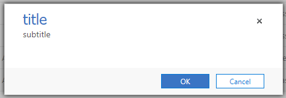
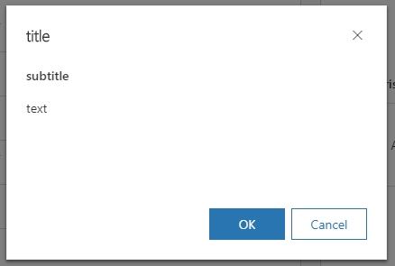

# Introduction 


# Using new form context

Version 9 deprecates old `Xrm.Page` API and replaces it with a form context. 

**TODO: expand these in following sections**
How to get context:
- form event handlers 
- grid event handlers
- ribbon JavaScript actions
- form web resources
- dialog web resources


## Form scripts


## Ribbon scripts

asd asd `PrimaryControl` asd

## Xrm.WebApi

Key differences in behavior between Web and Unified interface are:

- Return value:
    - Web: jQuery promise
    - Unified: native JavaScript promise

- `Xrm.WebApi.execute`
    - Web: exists, you can use it
    - Unified: does not exist. You have to use `Xrm.WebApi.online.execute`, which works only in online mode

## Xrm.Navigation

- Dialogs do not stop script execution anymore. Auto-save can happen while dialog is open.
- 

### openConfirmDialog

```JavaScript
Xrm.Navigation.openConfirmDialog({ 
  text: "text", 
  title: "title", 
  subtitle: "subtitle" 
});
```

 

 